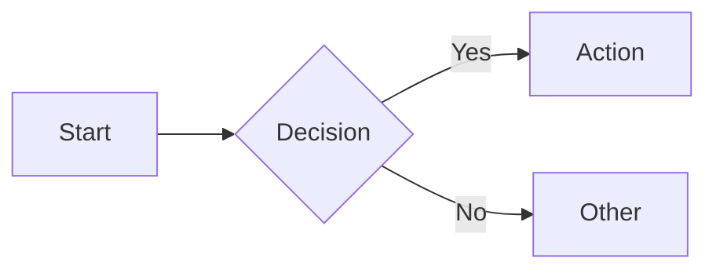

# markmap

[](https://gitter.im/gera2ld/markmap?utm_source=badge&utm_medium=badge&utm_campaign=pr-badge&utm_content=badge)

Visualize your Markdown as mindmaps.

This project is heavily inspired by [dundalek's markmap](https://github.com/dundalek/markmap).

👉 [Try it out](https://markmap.js.org/repl).

## Related Projects

Markmap is also available in:

- [VSCode](https://marketplace.visualstudio.com/items?itemName=gera2ld.markmap-vscode) and [Open VSX](https://open-vsx.org/extension/gera2ld/markmap-vscode)
- Vim / Neovim:
  - [coc-markmap](https://github.com/gera2ld/coc-markmap)  - powered by [coc.nvim](https://github.com/neoclide/coc.nvim)
  - [markmap.vim](https://github.com/Zeioth/markmap.nvim): for using without [coc.nvim](https://github.com/neoclide/coc.nvim)
- Emacs: [eaf-markmap](https://github.com/emacs-eaf/eaf-markmap) -- powered by [EAF](https://github.com/emacs-eaf/emacs-application-framework)
- MCP Server: [markmap-mcp-server](https://github.com/jinzcdev/markmap-mcp-server) [](https://www.npmjs.com/package/@jinzcdev/markmap-mcp-server) - powered by [MCP TypeScript SDK](https://github.com/modelcontextprotocol/typescript-sdk)

## Mermaid Diagrams

This fork of Markmap supports rendering [Mermaid](https://mermaid.js.org/) diagrams inline within mindmap nodes. Use standard fenced code blocks with the `mermaid` language identifier:

````markdown
## My Topic


````

The mermaid diagram will appear as a child node of the heading and render automatically.

### Supported Diagram Types

All Mermaid diagram types are supported, including:

- **Flowcharts** — `flowchart` / `graph`
- **Sequence diagrams** — `sequenceDiagram`
- **Gantt charts** — `gantt`
- **Class diagrams** — `classDiagram`
- **State diagrams** — `stateDiagram-v2`
- **And more** — any diagram type supported by Mermaid

### Customizing Diagram Styles

You can override the default mermaid diagram styles per-document using YAML frontmatter with `extraCss`:

````markdown
---
markmap:
  extraCss:
    - |
      <style>
      .mermaid .edge-pattern-solid,
      .mermaid .flowchart-link {
        stroke: #222 !important;
        stroke-width: 2.5px !important;
      }
      .mermaid marker path {
        fill: #222 !important;
      }
      </style>
---

# My Mindmap
````

This is useful for adjusting line thickness, colors, or other visual properties of rendered diagrams. The CSS targets Mermaid's internal SVG elements:

| Selector | What it styles |
|---|---|
| `.mermaid .edge-pattern-solid` | Flowchart connector lines |
| `.mermaid .flowchart-link` | Flowchart connector lines (alt class) |
| `.mermaid marker path` | Arrowhead markers on connectors |
| `.mermaid .node rect` | Node background rectangles |
| `.mermaid .label` | Text labels inside nodes |

## Installing from this Fork

Since this fork is not published to npm, install packages directly from the git repository using pnpm's git + subdirectory syntax:

```bash
pnpm add "markmap-cli@github:berttejeda/markmap#feature-mermaid&path:packages/markmap-cli"
```

Other packages in this monorepo (e.g. `markmap-lib`, `markmap-view`) can be installed the same way by changing the `path:` segment:

```bash
pnpm add "markmap-lib@github:berttejeda/markmap#feature-mermaid&path:packages/markmap-lib"
pnpm add "markmap-view@github:berttejeda/markmap#feature-mermaid&path:packages/markmap-view"
```

**How it works**: pnpm clones the full repository, detects the `pnpm-workspace.yaml`, and runs `pnpm install` at the repo root so internal `workspace:*` dependencies (e.g. `markmap-common`) resolve correctly. It then runs each package's `prepare` script to build `dist/` output, since built files are gitignored and not committed.

**Note**: If a package you need doesn't yet have a `prepare` script defined, add `"prepare": "pnpm build"` to its `package.json` under `scripts` so the install step builds it automatically.

## Usage

👉 [Read the documentation](https://markmap.js.org/docs) for more detail.
