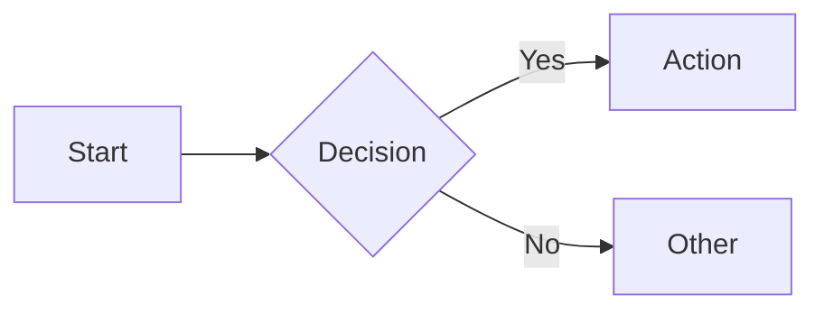

# markmap

[](https://gitter.im/gera2ld/markmap?utm_source=badge&utm_medium=badge&utm_campaign=pr-badge&utm_content=badge)

Visualize your Markdown as mindmaps.

This project is heavily inspired by [dundalek's markmap](https://github.com/dundalek/markmap).

👉 [Try it out](https://markmap.js.org/repl).

## Related Projects

Markmap is also available in:

- [VSCode](https://marketplace.visualstudio.com/items?itemName=gera2ld.markmap-vscode) and [Open VSX](https://open-vsx.org/extension/gera2ld/markmap-vscode)
- Vim / Neovim:
  - [coc-markmap](https://github.com/gera2ld/coc-markmap)  - powered by [coc.nvim](https://github.com/neoclide/coc.nvim)
  - [markmap.vim](https://github.com/Zeioth/markmap.nvim): for using without [coc.nvim](https://github.com/neoclide/coc.nvim)
- Emacs: [eaf-markmap](https://github.com/emacs-eaf/eaf-markmap) -- powered by [EAF](https://github.com/emacs-eaf/emacs-application-framework)
- MCP Server: [markmap-mcp-server](https://github.com/jinzcdev/markmap-mcp-server) [](https://www.npmjs.com/package/@jinzcdev/markmap-mcp-server) - powered by [MCP TypeScript SDK](https://github.com/modelcontextprotocol/typescript-sdk)

## Mermaid Diagrams

This fork of Markmap supports rendering [Mermaid](https://mermaid.js.org/) diagrams inline within mindmap nodes. Use standard fenced code blocks with the `mermaid` language identifier:

````markdown
## My Topic


````

The mermaid diagram will appear as a child node of the heading and render automatically.

### Supported Diagram Types

All Mermaid diagram types are supported, including:

- **Flowcharts** — `flowchart` / `graph`
- **Sequence diagrams** — `sequenceDiagram`
- **Gantt charts** — `gantt`
- **Class diagrams** — `classDiagram`
- **State diagrams** — `stateDiagram-v2`
- **And more** — any diagram type supported by Mermaid

### Customizing Diagram Styles

You can override the default mermaid diagram styles per-document using YAML frontmatter with `extraCss`:

````markdown
---
markmap:
  extraCss:
    - |
      <style>
      .mermaid .edge-pattern-solid,
      .mermaid .flowchart-link {
        stroke: #222 !important;
        stroke-width: 2.5px !important;
      }
      .mermaid marker path {
        fill: #222 !important;
      }
      </style>
---

# My Mindmap
````

This is useful for adjusting line thickness, colors, or other visual properties of rendered diagrams. The CSS targets Mermaid's internal SVG elements:

| Selector | What it styles |
|---|---|
| `.mermaid .edge-pattern-solid` | Flowchart connector lines |
| `.mermaid .flowchart-link` | Flowchart connector lines (alt class) |
| `.mermaid marker path` | Arrowhead markers on connectors |
| `.mermaid .node rect` | Node background rectangles |
| `.mermaid .label` | Text labels inside nodes |

## Installing directly from this repo

This fork is not published to npm. There are two ways to consume it: as a dependency in another project via pnpm's git + subdirectory syntax, or by cloning the monorepo directly.

### As a dependency via pnpm

Use pnpm's git + subdirectory syntax (`&path:`) to install an individual package straight from GitHub:

```bash
pnpm add "markmap-cli@git+https://github.com/berttejeda/markmap.git#feature-mermaid&path:packages/markmap-cli"
pnpm add "markmap-lib@git+https://github.com/berttejeda/markmap.git#feature-mermaid&path:packages/markmap-lib"
pnpm add "markmap-view@git+https://github.com/berttejeda/markmap.git#feature-mermaid&path:packages/markmap-view"
```

If you have SSH keys configured for GitHub, you can use the `github:` shorthand instead of an explicit `git+https://` URL:

```bash
pnpm add "markmap-cli@github:berttejeda/markmap#feature-mermaid&path:packages/markmap-cli"
```

**How it works**: pnpm clones the full repository, detects the `pnpm-workspace.yaml`, and runs `pnpm install` at the repo root so internal `workspace:*` dependencies (e.g. `markmap-common`) resolve correctly. The root `prepare` script then builds every workspace package's `dist/` output in dependency order (types first, then JS), since built files are gitignored and not committed.

**Allowing build scripts**: pnpm blocks build scripts from git-hosted packages by default as a supply-chain safety measure. The first time you install, you'll likely see an `ERR_PNPM_PREPARE_PACKAGE` / `allowBuilds` error. Add the following to your **own project's** `pnpm-workspace.yaml` (not this repo's):

```yaml
allowBuilds:
  markmap-cli: true
  esbuild: true
  nx: true
```

(`esbuild` and `nx` are transitive build tools used by this repo's own `vite`/`tsc` build steps.) Then rerun your `pnpm add` command.

### By cloning the monorepo

If you want to work on the source directly (e.g. to build the CLI locally or run watch mode):

```bash
git clone git@github.com:berttejeda/markmap.git
cd markmap
git checkout feature-mermaid
pnpm i
```

`pnpm i` triggers the root `prepare` script, which builds all 9 workspace packages in topological order (`markmap-common` → `markmap-view`/`markmap-html-parser` → `markmap-lib`/`markmap-render`/`markmap-toolbar` → `markmap-autoloader`/`markmap-cli`). This works the same whether it's a fresh clone or a git-hosted `pnpm add` install — the build always runs on install so `dist/*.d.ts` is available for every workspace package's dependents.

If a fresh `pnpm i` blocks build scripts for `esbuild`/`nx`, run `pnpm approve-builds` and select them, or add them to `allowBuilds` in this repo's own `pnpm-workspace.yaml`.

**Rebuilding after making changes**: `prepare` only runs automatically during install, not on every file change. After editing source in a package, rebuild it (and any packages that depend on it) from the repo root:

```bash
pnpm build:types
pnpm build:js
```

Both run recursively (`pnpm -r`) across all 9 workspace packages in dependency order, so changes to a shared package (e.g. `markmap-view`) are reflected in packages that depend on it (e.g. `markmap-cli`). To rebuild a single package instead, `cd` into it and run `pnpm build`.

Once built, you can run the CLI directly:

```bash
node packages/markmap-cli/bin/cli.js -w your-file.md
```

**Exposing `markmap` globally**: `pnpm link --global` doesn't work reliably from inside a workspace package — it re-resolves `markmap-cli`'s dependencies in isolation from the monorepo, so `workspace:*` deps like `markmap-common` fail to resolve (`ERR_PNPM_WORKSPACE_PKG_NOT_FOUND`). Instead, symlink the built CLI directly into pnpm's global bin directory:

```bash
chmod +x packages/markmap-cli/bin/cli.js
ln -sf "$(pwd)/packages/markmap-cli/bin/cli.js" "$(pnpm bin -g)/markmap"
```

Verify it resolves to your local build:

```bash
which markmap
markmap --version
```

Since the symlink points to `bin/cli.js` (which just imports `dist/cli.js`), you don't need to relink after rebuilding — only if the repo's path changes.

## Usage

👉 [Read the documentation](https://markmap.js.org/docs) for more detail.
